# 系統架構分析報告 — nanobot-ai v0.1.4.post5

> 生成日期：2026-03-26 | 分析範圍：74 Python 源文件 + 4 TypeScript 文件 | 總代碼行數：~20,388

---

## 1. 專案概覽

| 維度 | 詳情 |
|:---|:---|
| **專案名稱** | nanobot-ai |
| **版本** | 0.1.4.post5 |
| **定位** | 輕量級個人 AI 助手框架 |
| **語言** | Python 3.11+ (主體) / TypeScript (WhatsApp Bridge) |
| **構建系統** | Hatchling (PEP 517) |
| **入口** | `nanobot.cli.commands:app` (Typer CLI) |
| **容器化** | Dockerfile (uv + Node.js 20) / Apple Container / Docker Compose |

### 核心依賴

| 類別 | 套件 | 用途 |
|:---|:---|:---|
| **LLM SDK** | `openai`, `anthropic` | OpenAI 兼容 / Anthropic 原生 API |
| **配置** | `pydantic`, `pydantic-settings` | Schema 驗證 + 環境變數 |
| **CLI** | `typer`, `rich`, `questionary`, `prompt-toolkit` | 終端 UI + 互動式嚮導 |
| **網路** | `httpx`, `websockets`, `websocket-client` | HTTP / WebSocket 通訊 |
| **排程** | `croniter` | Cron 表達式解析 |
| **Token** | `tiktoken` | Token 計數 |
| **搜索** | `ddgs` | DuckDuckGo 搜索 |
| **MCP** | `mcp>=1.26` | Model Context Protocol 客戶端 |
| **頻道 SDK** | `python-telegram-bot`, `slack-sdk`, `lark-oapi`, `dingtalk-stream`, `qq-botpy`, `python-socketio` | 各頻道原生 SDK |
| **安全** | `readability-lxml`, `json-repair` | 內容提取 / JSON 修復 |

### 代碼規模分佈

| 模組 | 文件數 | 行數 | 佔比 |
|:---|:---|:---|:---|
| `channels/` | 14 | 8,841 | 43.4% |
| `providers/` | 7 | 2,357 | 11.6% |
| `agent/` | 12 | 3,127 | 15.3% |
| `cli/` | 5 | 2,555 | 12.5% |
| `config/` | 4 | 415 | 2.0% |
| `cron/` | 3 | 489 | 2.4% |
| `session/` | 2 | 270 | 1.3% |
| 其他 (`bus/`, `heartbeat/`, `security/`, `utils/`, `command/`, `skills/scripts`) | 12 | 1,334 | 6.5% |
| `bridge/` (TypeScript) | 4 | 491 | 2.4% |
| **合計** | **74+4** | **~20,388** | **100%** |

---

## 2. 系統上下文圖 (C4 Model)

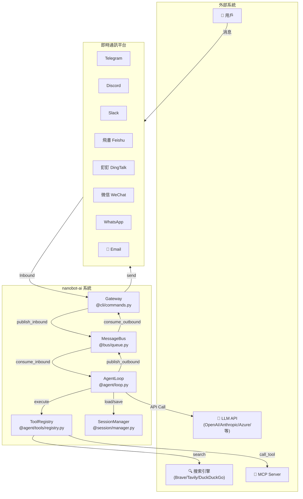

---

## 3. 模組依賴矩陣

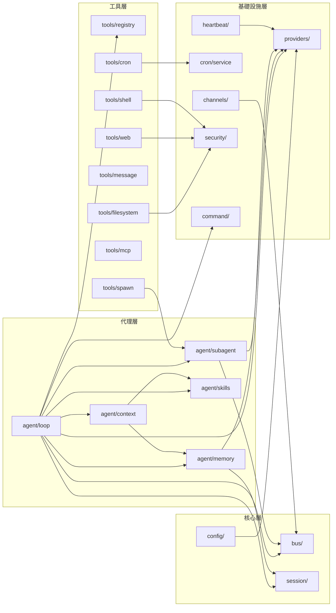

---

## 4. 核心業務流時序圖

### 4.1 用戶消息處理流程

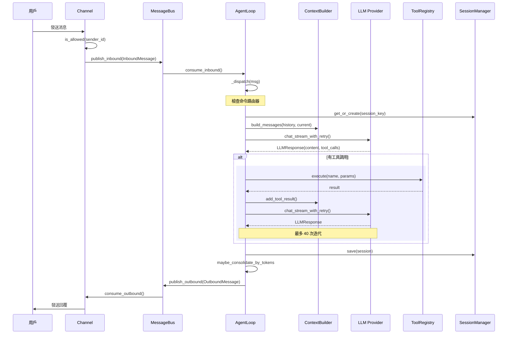

### 4.2 記憶體整合流程

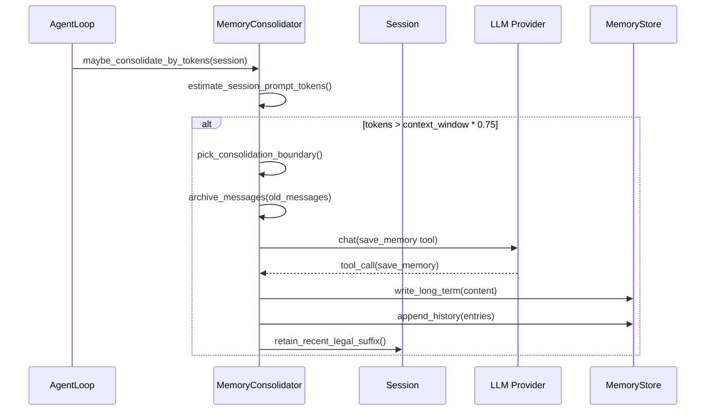

---

## 5. 調用鏈分析

### 5.1 God Class 識別

| 排名 | 類別 | 文件 | 行數 | 職責數 | 風險等級 |
|:---|:---|:---|:---|:---|:---|
| 1 | `AgentLoop` | `@agent/loop.py` | 644 | 8+ | ⚠️ 中高 |
| 2 | `WeixinChannel` | `@channels/weixin.py` | 1033 | 6+ | ⚠️ 中高 |
| 3 | `FeishuChannel` | `@channels/feishu.py` | 1250 | 7+ | ⚠️ 中高 |
| 4 | `MochatChannel` | `@channels/mochat.py` | 947 | 6+ | ⚠️ 中 |
| 5 | `TelegramChannel` | `@channels/telegram.py` | 945 | 6+ | ⚠️ 中 |

### 5.2 AgentLoop 耦合分析

`AgentLoop` (`@agent/loop.py`) 是系統核心，直接依賴 **12 個模組**：

| 依賴 | 類型 | 耦合方式 |
|:---|:---|:---|
| `MessageBus` | 核心 | 構造注入 |
| `LLMProvider` | 核心 | 構造注入 |
| `ContextBuilder` | 核心 | 內部創建 |
| `MemoryConsolidator` | 核心 | 內部創建 |
| `SkillsLoader` | 核心 | 內部創建 |
| `SubagentManager` | 核心 | 內部創建 |
| `ToolRegistry` | 核心 | 內部創建 |
| `SessionManager` | 核心 | 構造注入 |
| `CommandRouter` | 命令 | 內部創建 |
| `CronService` | 服務 | 構造注入 |
| 7 個 Tool 類別 | 工具 | 內部註冊 |
| `channels_config` | 配置 | 構造注入 |

**職責分析：**
1. 消息消費與分發
2. 工具註冊與執行
3. LLM 調用（含流式）
4. 會話管理
5. 記憶體整合觸發
6. 子代理管理
7. MCP 連接生命週期
8. 背景任務追蹤

### 5.3 大文件分析 (>500 行)

| 文件 | 行數 | 主要原因 |
|:---|:---|:---|
| `channels/feishu.py` | 1250 | 飛書 API 複雜度 (卡片/富文本/加密) |
| `cli/commands.py` | 1233 | gateway + agent + onboard 等多命令集中 |
| `channels/weixin.py` | 1033 | 私人微信協議 (登錄/加密/CDN 上傳) |
| `cli/onboard.py` | 1023 | 互動式配置嚮導 (TUI) |
| `channels/mochat.py` | 947 | 雙傳輸 (Socket.IO + HTTP) + 延遲緩衝 |
| `channels/telegram.py` | 945 | Markdown 轉換 + 流式編輯 + 媒體群組 |
| `channels/matrix.py` | 739 | E2EE + 線程 + 媒體上傳 |
| `agent/loop.py` | 644 | 核心代理循環 (見 God Class 分析) |
| `channels/qq.py` | 639 | botpy SDK + 分塊下載 |
| `channels/dingtalk.py` | 580 | Stream SDK + Token 管理 |
| `providers/openai_compat_provider.py` | 554 | 通用 OpenAI 兼容適配 |

---

## 6. 異步流分析

### 6.1 asyncio 架構

所有 I/O 均基於 `asyncio`，使用 `asyncio.run()` 啟動於 `gateway` 命令：

```text
asyncio.run(run())
├── agent.run()              # 主消費循環 (無限)
├── channels.start_all()     # 所有頻道並行啟動
│   ├── channel.start()      # 各頻道獨立 coroutine
│   └── _dispatch_outbound() # 出站分發循環
├── cron.start()             # 定時任務服務
└── heartbeat.start()        # 心跳服務
```

### 6.2 數據一致性風險

| 風險 | 位置 | 嚴重度 | 描述 |
|:---|:---|:---|:---|
| **會話並發寫入** | `@agent/loop.py:313-330` | ⚠️ 中 | 使用 `asyncio.Lock` 保護，但同一 session_key 的多消息排隊等待，**非先入先出** |
| **記憶體整合競態** | `@agent/memory.py:233-280` | ⚠️ 中 | 整合在背景任務執行，與主循環可能交叉讀寫 `MEMORY.md` |
| **Cron 存儲外部修改** | `@cron/service.py:85` | ⚠️ 低 | mtime 檢測外部修改，但檢測與載入之間存在 TOCTOU 窗口 |
| **頻道出站分發** | `@channels/manager.py:119-168` | ✅ 低 | 單一出站消費者，無競態 |
| **子代理結果回注** | `@agent/subagent.py:125-140` | ⚠️ 低 | 通過 MessageBus 回注，與普通消息混合，順序取決於完成時間 |

### 6.3 背景任務生命週期

| 任務類型 | 管理方式 | 清理機制 |
|:---|:---|:---|
| 記憶體整合 | `_schedule_background()` → `_bg_tasks` set | done callback 自動移除 |
| 子代理 | `SubagentManager._tasks` dict | done callback + cancel_by_session |
| 頻道重連 | 各頻道內部 while True 循環 | `stop()` 設置 flag |
| Cron Timer | `_timer_handle` (asyncio.Handle) | `stop()` cancel |
| Heartbeat | `_task` (asyncio.Task) | `stop()` cancel |

---

## 7. 模式審計

### 7.1 聲稱架構 vs 實際實現

| 模式 | 聲稱 | 實際 | 合規度 |
|:---|:---|:---|:---|
| **Plugin Architecture** | 頻道可插拔 | ✅ `entry_points` + `pkgutil` 自動發現 | 90% |
| **Message Bus** | 解耦通訊 | ✅ `asyncio.Queue` 雙向佇列 | 85% |
| **Provider Registry** | 元數據驅動 | ✅ `ProviderSpec` frozen dataclass + `find_by_name` | 90% |
| **Tool Framework** | 抽象基類 + 註冊 | ✅ `Tool(ABC)` + `ToolRegistry` + JSON Schema | 90% |
| **Session Management** | JSONL 持久化 | ✅ 追加式寫入 + 法律邊界對齊 | 85% |
| **Clean Architecture** | 分層分離 | ⚠️ `AgentLoop` 混合多職責 | 60% |

### 7.2 設計模式識別

| 模式 | 實例 | 文件 |
|:---|:---|:---|
| **Template Method** | `BaseChannel.start/stop/send` | `@channels/base.py` |
| **Strategy** | 多搜索提供者 (Brave/Tavily/DuckDuckGo) | `@agent/tools/web.py` |
| **Adapter** | OpenAI SDK 包裝 / MCP Tool 包裝 | `@providers/openai_compat_provider.py`, `@agent/tools/mcp.py` |
| **Registry** | `ToolRegistry`, `PROVIDERS`, `discover_all()` | 多處 |
| **Observer** | `MessageBus` pub/sub | `@bus/queue.py` |
| **Factory** | `_make_provider()` 基於配置創建 | `@cli/commands.py` |
| **Command** | `CommandRouter` 四層分發 | `@command/router.py` |
| **Mediator** | `ChannelManager` 出站路由 | `@channels/manager.py` |

---

## 8. P0 風險清單

### P0-1: ~~os.environ 全局污染~~ ✅ 已修復

~~`@providers/openai_compat_provider.py:126-138` — `_setup_env()` 方法將 API Key 寫入全局環境變數，導致多 Provider 實例間互相污染。~~

**狀態：已修復** — 移除 `_setup_env()` 方法，`AsyncOpenAI` 已通過構造函數接收 `api_key`。

### P0-2: 會話鎖粒度不足

**位置：** `@agent/loop.py:306-330`

**問題：** 同一 `session_key` 的多條消息使用 `asyncio.Lock()` 串行化，但當 `concurrent_requests=0`（無限制）時，可能出現大量排隊任務耗盡記憶體。

**建議：**
```python
# 在 AgentLoop.__init__ 中加入有界信號量
self._session_semaphore: dict[str, asyncio.Semaphore] = {}
MAX_CONCURRENT_PER_SESSION = 3

async def _get_session_semaphore(self, key: str) -> asyncio.Semaphore:
    if key not in self._session_semaphore:
        self._session_semaphore[key] = asyncio.Semaphore(MAX_CONCURRENT_PER_SESSION)
    return self._session_semaphore[key]
```

### P0-3: Weixin 會話暫停機制

**位置：** `@channels/weixin.py:476-482`

**問題：** 遇到 `-14` 錯誤時暫停 **1 小時**，期間所有消息處理停止。無法區分暫時性故障與永久性認證失敗。

**建議：**
```python
# 漸進式退避取代固定暫停
_PAUSE_DELAYS = [60, 300, 900, 3600]  # 1m, 5m, 15m, 1h

async def _handle_auth_error(self):
    idx = min(self._consecutive_auth_errors, len(self._PAUSE_DELAYS) - 1)
    delay = self._PAUSE_DELAYS[idx]
    self._consecutive_auth_errors += 1
    logger.warning("Auth error, pausing for {}s (attempt {})", delay, idx + 1)
    await asyncio.sleep(delay)
```

### P0-4: 無界狀態累積

**位置：** 多處頻道實現

| 頻道 | 數據結構 | 風險 |
|:---|:---|:---|
| WeCom | `chat_frames: dict` | 無上限，長時間運行 OOM |
| Mochat | `_delay_state: dict[str, DelayState]` | 每個目標一個鎖+緩衝 |
| Telegram | `_stream_state: dict` | 每個活躍對話一個 |
| Discord | 無清理的 typing 任務 | Task 洩漏 |

**建議：**
```python
# 通用 LRU 清理模式
from collections import OrderedDict

class BoundedDict(OrderedDict):
    def __init__(self, maxsize: int = 1000):
        super().__init__()
        self._maxsize = maxsize

    def __setitem__(self, key, value):
        if key in self:
            self.move_to_end(key)
        super().__setitem__(key, value)
        while len(self) > self._maxsize:
            self.popitem(last=False)
```

### P0-5: SSL 驗證降級

**位置：** `@providers/openai_codex_provider.py:175-185`

**問題：** `CERTIFICATE_VERIFY_FAILED` 時自動重試 `verify=False`，靜默降級 TLS 安全性。

**建議：**
```python
# 移除自動降級，改為明確配置
if isinstance(e, httpx.ConnectError) and "CERTIFICATE_VERIFY_FAILED" in str(e):
    raise RuntimeError(
        "SSL certificate verification failed. "
        "Set NANOBOT_SSL_VERIFY=false to disable (not recommended)."
    ) from e
```

### P0-6: 硬編碼安全相關常量

| 位置 | 常量 | 風險 |
|:---|:---|:---|
| `@agent/tools/shell.py:29-39` | deny_patterns 正則 | 繞過可能性 (unicode/encoding) |
| `@security/network.py:12-30` | 私有 IP 範圍 | 遺漏 IPv6 特殊地址 |
| `@providers/base.py:91-96` | 瞬態錯誤關鍵字 | 不同 Provider 錯誤格式差異 |

---

## 9. 儀表板

| 維度 | 現況評分 (1-10) | 關鍵證據 (File) | 潛在風險 |
|:---|:---|:---|:---|
| **模組解耦** | 7 | `@bus/queue.py` MessageBus 模式；`@channels/registry.py` 插件發現 | `AgentLoop` 耦合 12 個模組 (God Class) |
| **測試友好度** | 5 | `@agent/tools/base.py` 抽象基類可 Mock | 無 DI 容器；`AgentLoop` 內部創建多數依賴 |
| **性能瓶頸** | 6 | `@agent/memory.py` Token 估算 + 整合 | 大會話的 Token 計數 O(n)；無快取 |
| **安全性** | 7 | `@security/network.py` SSRF 防護；`@agent/tools/shell.py` 命令守衛 | SSL 降級 (P0-5)；shell deny_patterns 可繞過 |
| **代碼品質** | 7 | 一致的 async/await 模式；Pydantic Schema | 5 個頻道超 700 行；缺乏類型存根 |
| **可擴展性** | 8 | `entry_points` 外掛頻道；`MCPToolWrapper` 動態工具 | 單進程架構，無水平擴展 |
| **可運維性** | 6 | `loguru` 日誌；`CronService` 持久化 | 無 metrics/tracing；無健康檢查端點 |

---

## 10. 改進建議

### 建議 1：拆分 AgentLoop (降低耦合)

將 `AgentLoop` 的工具註冊、MCP 連接、消息處理拆分為獨立類別：

```python
# @agent/tool_manager.py (新文件)
class ToolManager:
    """Manages tool registration, execution, and MCP connections."""

    def __init__(self, workspace: Path, config: ToolsConfig, cron_service: CronService):
        self.registry = ToolRegistry()
        self._mcp_stack = AsyncExitStack()
        self._workspace = workspace
        self._config = config
        self._cron = cron_service

    async def register_defaults(self, bus: MessageBus, provider: LLMProvider) -> None:
        """Register all built-in tools."""
        self.registry.register(ReadFileTool(self._workspace))
        self.registry.register(WriteFileTool(self._workspace))
        # ... 其他工具
        if self._config.exec.enable:
            self.registry.register(ExecTool(
                timeout=self._config.exec.timeout,
                working_dir=str(self._workspace),
            ))

    async def connect_mcp(self) -> None:
        """Connect to configured MCP servers."""
        if self._config.mcp_servers:
            await connect_mcp_servers(
                self._config.mcp_servers, self.registry, self._mcp_stack
            )

    async def close_mcp(self) -> None:
        await self._mcp_stack.aclose()
```

### 建議 2：添加健康檢查端點

Gateway 應提供 HTTP 健康檢查，支持容器化監控：

```python
# @gateway/health.py (新文件)
from aiohttp import web

class HealthServer:
    def __init__(self, host: str, port: int, channels: ChannelManager, agent: AgentLoop):
        self._host = host
        self._port = port
        self._channels = channels
        self._agent = agent

    async def start(self) -> None:
        app = web.Application()
        app.router.add_get("/health", self._health)
        app.router.add_get("/status", self._status)
        runner = web.AppRunner(app)
        await runner.setup()
        site = web.TCPSite(runner, self._host, self._port)
        await site.start()

    async def _health(self, request: web.Request) -> web.Response:
        return web.json_response({"status": "ok"})

    async def _status(self, request: web.Request) -> web.Response:
        return web.json_response({
            "channels": self._channels.get_status(),
            "version": __version__,
        })
```

### 建議 3：頻道狀態 LRU 清理

為所有頻道的內部狀態字典添加統一的 LRU 清理機制：

```python
# @channels/base.py 中添加
import weakref
from collections import OrderedDict

class BaseChannel(ABC):
    _MAX_STATE_ENTRIES = 2000

    def _make_bounded_dict(self, maxsize: int | None = None) -> OrderedDict:
        """Create a self-pruning OrderedDict for channel state."""
        d = OrderedDict()
        limit = maxsize or self._MAX_STATE_ENTRIES
        original_setitem = d.__setitem__

        def bounded_setitem(key, value):
            if key in d:
                d.move_to_end(key)
            original_setitem(key, value)
            while len(d) > limit:
                d.popitem(last=False)

        d.__setitem__ = bounded_setitem
        return d
```

### 建議 4：結構化日誌 + Metrics

添加 OpenTelemetry 基礎設施為未來可觀測性做準備：

```python
# @utils/metrics.py (新文件)
import time
from contextlib import asynccontextmanager
from loguru import logger

@asynccontextmanager
async def track_llm_call(provider: str, model: str):
    """Track LLM API call duration and status."""
    start = time.monotonic()
    status = "ok"
    try:
        yield
    except Exception as e:
        status = type(e).__name__
        raise
    finally:
        duration_ms = (time.monotonic() - start) * 1000
        logger.info(
            "llm_call provider={} model={} status={} duration_ms={:.0f}",
            provider, model, status, duration_ms,
        )
```

### 建議 5：Provider 自動測試框架

為每個 Provider 添加統一的集成測試介面：

```python
# @providers/base.py 中添加
class LLMProvider(ABC):
    async def test_connection(self) -> tuple[bool, str]:
        """Test provider connectivity. Returns (ok, message)."""
        try:
            resp = await self.chat(
                messages=[{"role": "user", "content": "ping"}],
                model=self.get_default_model(),
                max_tokens=5,
            )
            return True, f"OK (model: {self.get_default_model()})"
        except Exception as e:
            return False, f"Failed: {e}"
```

---

## 11. WeChat (微信) 即時通訊頻道詳細分析

> 源碼：`@channels/weixin.py` | 1,034 行 | 協議逆向自 `@tencent-weixin/openclaw-weixin` v1.0.3

### 11.1 架構概覽

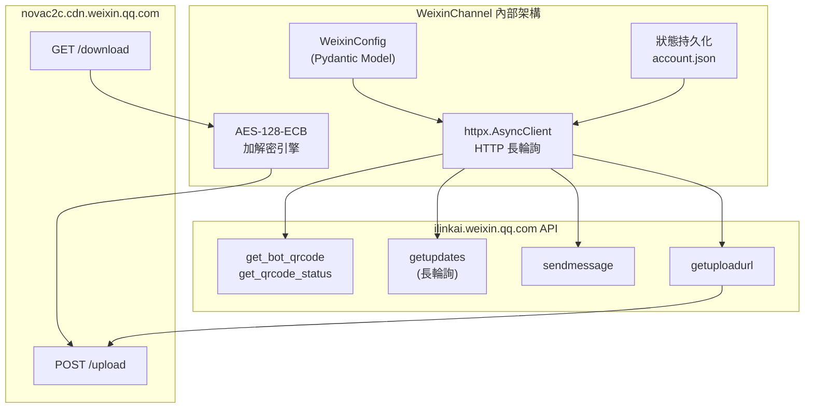

### 11.2 協議分析

#### API 端點矩陣

| 端點 | 方法 | 用途 | 認證 | 參考源碼 |
|:---|:---|:---|:---|:---|
| `ilink/bot/get_bot_qrcode` | GET | 獲取登錄 QR 碼 | 否 | `@channels/weixin.py:246-257` |
| `ilink/bot/get_qrcode_status` | GET | 輪詢 QR 掃碼狀態 | 否 | `@channels/weixin.py:272-277` |
| `ilink/bot/getupdates` | POST | 長輪詢收取消息 | Bearer Token | `@channels/weixin.py:465` |
| `ilink/bot/sendmessage` | POST | 發送文字/媒體消息 | Bearer Token | `@channels/weixin.py:786` |
| `ilink/bot/getuploadurl` | POST | 獲取 CDN 上傳參數 | Bearer Token | `@channels/weixin.py:855` |
| `{cdn}/upload` | POST | 上傳加密媒體文件 | Query Param | `@channels/weixin.py:873-878` |
| `{cdn}/download` | GET | 下載加密媒體文件 | Query Param | `@channels/weixin.py:675-683` |

#### HTTP 請求頭協議

```text
Authorization: Bearer {bot_token}          # 從 QR 登錄獲取
AuthorizationType: ilink_bot_token         # 固定值
X-WECHAT-UIN: {random_base64}             # 每次請求隨機生成 (uint32→str→base64)
SKRouteTag: {route_tag}                   # 可選路由標籤
Content-Type: application/json
```

**關鍵設計：** `X-WECHAT-UIN` 每次請求重新生成隨機值 (`@channels/weixin.py:186-194`)，匹配參考插件的 `randomWechatUin()` 實現。

### 11.3 消息生命週期時序圖

#### 入站消息流程

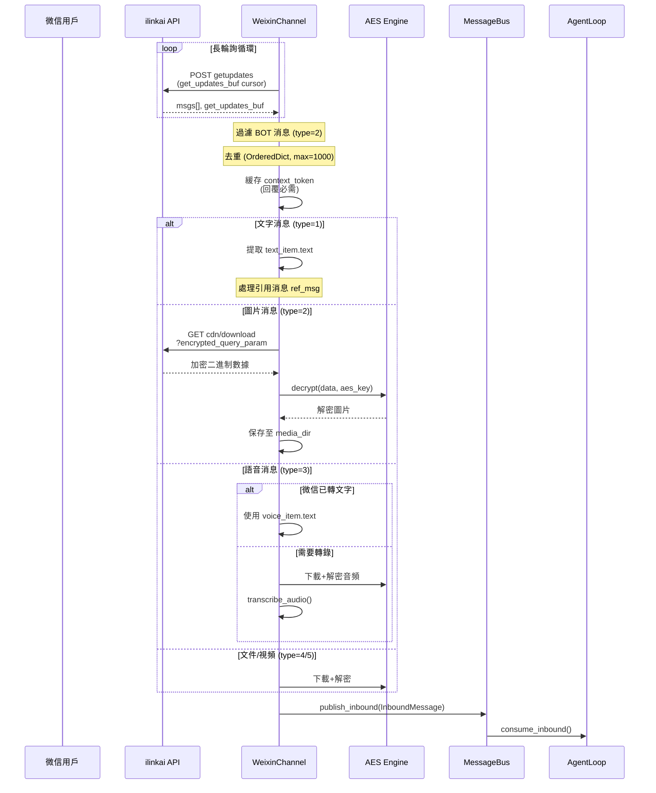

#### 出站媒體上傳流程

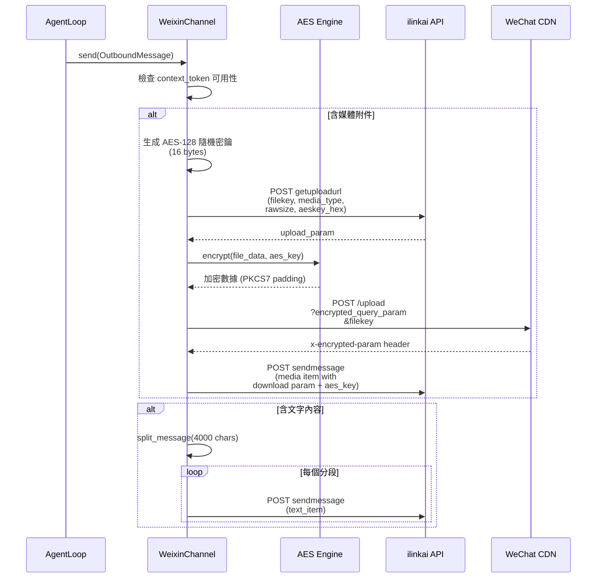

### 11.4 AES 加密子系統詳解

> 源碼：`@channels/weixin.py:938-1034`

#### 密鑰編碼方案

微信 CDN 存在 **兩種** AES 密鑰編碼格式，源自協議的歷史演進：

| 場景 | 密鑰來源 | 編碼路徑 | 最終密鑰 |
|:---|:---|:---|:---|
| **圖片下載** | `image_item.aeskey` | hex string → `bytes.fromhex()` → base64 | 16 bytes |
| **其他媒體下載** | `media.aes_key` | 已是 base64 | 16 bytes |
| **上傳** (所有類型) | 客戶端生成 | `os.urandom(16)` → hex → 發送給 API | 16 bytes |

**`_parse_aes_key()` 雙路徑解析** (`@channels/weixin.py:944-963`)：

```text
base64 decode
    ├── 16 bytes → 直接使用 (raw key)
    └── 32 bytes + 全部為 hex chars → hex decode → 16 bytes
```

#### 加密庫降級鏈

```python
# 優先 pycryptodome，降級到 cryptography，最終返回原始數據
try:
    from Crypto.Cipher import AES      # pycryptodome (快)
except ImportError:
    from cryptography.hazmat...        # cryptography (標準)
except ImportError:
    return data                         # 無加密庫，靜默降級 ⚠️
```

**風險：** 無加密庫時靜默返回原始數據，可能導致上傳的文件無法被對方解密。

### 11.5 狀態管理

#### 持久化狀態 (`account.json`)

```json
{
    "token": "5ab928d45a1e@im.bot:...",
    "get_updates_buf": "eyJ...",
    "context_tokens": {
        "user_id_1": "ctx_token_abc",
        "user_id_2": "ctx_token_def"
    },
    "base_url": "https://ilinkai.weixin.qq.com"
}
```

| 字段 | 用途 | 生命週期 |
|:---|:---|:---|
| `token` | Bot 認證令牌 | QR 登錄產生，會話過期失效 |
| `get_updates_buf` | 長輪詢游標 | 每次 getupdates 更新 |
| `context_tokens` | 每用戶回覆令牌 | 每條入站消息更新 |
| `base_url` | API 基礎 URL | 登錄時服務端指定 |

#### 記憶體中狀態

| 狀態 | 類型 | 上限 | 清理機制 |
|:---|:---|:---|:---|
| `_processed_ids` | `OrderedDict` | 1,000 | FIFO 淘汰 (`@channels/weixin.py:522-523`) |
| `_context_tokens` | `dict` | **無上限** ⚠️ | 無 |
| `_session_pause_until` | `float` | 1 值 | 時間自然過期 |

### 11.6 錯誤處理與韌性

#### 重試策略

```text
正常輪詢
    ├── httpx.TimeoutException → 立即重試 (長輪詢正常行為)
    ├── 其他異常 → consecutive_failures++
    │   ├── < 3 次 → sleep(2s) 重試
    │   └── ≥ 3 次 → sleep(30s) 退避，重置計數
    └── errcode == -14 → 暫停 1 小時 ⚠️
```

#### QR 登錄狀態機

```text
fetch_qr_code → 顯示 QR
    │
    ├── status="wait" → 繼續輪詢 (1s)
    ├── status="scaned" → 等待確認
    ├── status="confirmed" → 提取 token → 成功
    └── status="expired" → refresh_count++
        ├── ≤ 3 次 → 刷新 QR
        └── > 3 次 → 放棄
```

### 11.7 消息類型支持矩陣

| 消息類型 | 入站接收 | 出站發送 | 媒體處理 |
|:---|:---|:---|:---|
| **文字** (type=1) | ✅ 含引用支持 | ✅ 自動分段 (4000 字) | — |
| **圖片** (type=2) | ✅ CDN 下載+解密 | ✅ 加密上傳 | AES-128-ECB |
| **語音** (type=3) | ✅ 微信轉文字/本地轉錄 | ❌ | AES-128-ECB |
| **文件** (type=4) | ✅ CDN 下載+解密 | ✅ 加密上傳 | AES-128-ECB |
| **視頻** (type=5) | ✅ CDN 下載+解密 | ✅ 加密上傳 | AES-128-ECB |

### 11.8 安全性分析

| 維度 | 現狀 | 風險等級 | 說明 |
|:---|:---|:---|:---|
| **傳輸加密** | ✅ HTTPS | 低 | 所有 API 調用經 HTTPS |
| **媒體加密** | ✅ AES-128-ECB | ⚠️ 中 | ECB 模式存在 pattern leakage，但為協議規定 |
| **Token 存儲** | ⚠️ 明文 JSON | 中 | `account.json` 存儲明文 token |
| **加密庫降級** | ⚠️ 靜默降級 | 中高 | 無加密庫時上傳明文 (`@channels/weixin.py:993-994`) |
| **`context_token` 無上限** | ⚠️ 記憶體洩漏 | 低 | 長時間運行大量用戶可能耗盡記憶體 |
| **MD5 校驗** | ⚠️ MD5 | 低 | 上傳使用 MD5 校驗 (`@channels/weixin.py:816`)，已知碰撞風險但僅用於完整性 |

### 11.9 協議特殊設計

#### 1. `context_token` 回覆機制

微信 API 要求每條回覆攜帶對方最新消息的 `context_token`。若無此 token，消息 **無法發送**：

```python
# @weixin.py:724-730
ctx_token = self._context_tokens.get(msg.chat_id, "")
if not ctx_token:
    logger.warning("WeChat: no context_token for chat_id={}, cannot send", msg.chat_id)
    return  # 靜默丟棄消息
```

**影響：** 如果 bot 從未收到某用戶消息，則無法主動發起對話。

#### 2. CDN 雙跳上傳

出站媒體需要 **三步** 才能發送成功：

```text
getuploadurl → 獲取 upload_param
CDN POST /upload → 獲取 x-encrypted-param (download_param)
sendmessage → 攜帶 download_param 發送
```

任一步驟失敗都會導致媒體發送失敗，且沒有重試機制。

#### 3. 服務端動態超時

```python
# @weixin.py:486-489 — 服務端可動態調整長輪詢超時
server_timeout_ms = data.get("longpolling_timeout_ms")
if server_timeout_ms and server_timeout_ms > 0:
    self._next_poll_timeout_s = max(server_timeout_ms // 1000, 5)
```

### 11.10 WeChat 頻道改進建議

#### 建議 A：`context_token` LRU 限制

```python
# @weixin.py __init__ 中替換
from collections import OrderedDict

class WeixinChannel(BaseChannel):
    _MAX_CONTEXT_TOKENS = 5000

    def __init__(self, config, bus):
        # ...
        self._context_tokens: OrderedDict[str, str] = OrderedDict()

    def _cache_context_token(self, user_id: str, token: str) -> None:
        if user_id in self._context_tokens:
            self._context_tokens.move_to_end(user_id)
        self._context_tokens[user_id] = token
        while len(self._context_tokens) > self._MAX_CONTEXT_TOKENS:
            self._context_tokens.popitem(last=False)
```

#### 建議 B：加密庫缺失時啟動警告

```python
# @weixin.py start() 開頭添加
async def start(self) -> None:
    # Pre-check crypto availability
    _has_crypto = False
    try:
        from Crypto.Cipher import AES
        _has_crypto = True
    except ImportError:
        try:
            from cryptography.hazmat.primitives.ciphers import Cipher
            _has_crypto = True
        except ImportError:
            pass
    if not _has_crypto:
        logger.warning(
            "WeChat: no AES library found. Media will be sent/received unencrypted. "
            "Install: pip install pycryptodome"
        )
    # ... existing start logic
```

#### 建議 C：漸進式會話暫停 (替代固定 1 小時)

```python
_PAUSE_BACKOFF = [60, 300, 900, 3600]  # 1m → 5m → 15m → 1h

def _pause_session(self) -> None:
    idx = getattr(self, '_pause_count', 0)
    idx = min(idx, len(self._PAUSE_BACKOFF) - 1)
    duration = self._PAUSE_BACKOFF[idx]
    self._session_pause_until = time.time() + duration
    self._pause_count = idx + 1
    logger.warning("Session paused for {}s (attempt {})", duration, idx + 1)

def _reset_pause(self) -> None:
    """Call after successful poll to reset backoff."""
    self._pause_count = 0
```

---

## 12. 部署遷移指南 — Docker Image 打包與 VPS 部署

### 12.1 架構概述

nanobot 的容器化部署採用 **代碼打包進映像 + 配置外掛載** 的分離策略：

| 層級 | 內容 | 位置 |
|:---|:---|:---|
| **Docker Image** | Python 依賴、Node.js Bridge、nanobot 源碼 | 映像內 `/app/` |
| **運行時配置** | API Keys、Agent 設定、對話歷史 | 宿主機 `~/.nanobot` → 容器 `/root/.nanobot` |

這意味著映像本身**不含敏感資訊**，可安全傳輸；只需額外複製 `~/.nanobot` 配置目錄即可在新環境還原完整服務。

### 12.2 Docker 實作詳解

#### 12.2.1 基礎映像與構建層

參考 `@Dockerfile`，映像構建採用**分層快取策略**，從上到下依序構建：

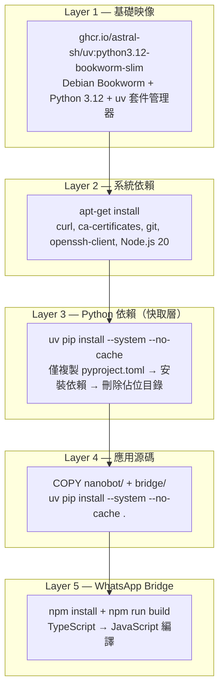

#### 12.2.2 Dockerfile 逐段解析

| 階段 | Dockerfile 指令 | 用途 | 快取策略 |
|:---|:---|:---|:---|
| **基礎映像** | `FROM ghcr.io/astral-sh/uv:python3.12-bookworm-slim` | Debian Slim + Python 3.12 + uv（Rust 實作的快速套件管理器） | 固定版本，極少變動 |
| **系統依賴** | `RUN apt-get install ... nodejs` | 安裝 Node.js 20（WhatsApp Bridge 需要）、curl、git | 僅新增系統套件時失效 |
| **Python 依賴** | `COPY pyproject.toml` → `uv pip install` | 先複製依賴清單安裝，源碼變更不會觸發重裝 | **關鍵快取層** — 依賴不變時跳過 |
| **源碼安裝** | `COPY nanobot/ bridge/` → `uv pip install` | 複製完整源碼並安裝 nanobot CLI | 每次源碼修改都重建 |
| **Bridge 構建** | `npm install && npm run build` | 編譯 TypeScript WhatsApp Bridge | 僅 bridge/ 變更時重建 |
| **入口點** | `ENTRYPOINT ["nanobot"]` + `CMD ["status"]` | 預設執行 `nanobot status`，可被覆蓋 | — |

#### 12.2.3 .dockerignore 排除清單

`@.dockerignore` 確保構建上下文不包含無關檔案：

```text
__pycache__          # Python 快取
*.pyc / *.pyo / *.pyd  # 編譯產物
*.egg-info / dist/ / build/  # 打包產物
.git                 # Git 歷史（~100MB+）
.env                 # 環境變數（含敏感資訊）
.assets              # 靜態資源
node_modules/        # Node 依賴（容器內重新安裝）
bridge/dist/         # Bridge 編譯產物（容器內重新構建）
workspace/           # 用戶工作空間（透過掛載提供）
```

#### 12.2.4 Python 依賴清單

`@pyproject.toml` 定義的核心依賴（51 個直接依賴）：

| 類別 | 套件 | 用途 |
|:---|:---|:---|
| **CLI 框架** | `typer`, `rich`, `prompt-toolkit`, `questionary` | 命令列介面、交互式對話 |
| **AI Provider** | `anthropic`, `openai` | Claude / OpenAI API 客戶端 |
| **HTTP / WebSocket** | `httpx`, `websockets`, `websocket-client` | 非同步 HTTP、雙向通訊 |
| **Channel SDK** | `python-telegram-bot`, `slack-sdk`, `dingtalk-stream`, `lark-oapi`, `qq-botpy` | 各平台即時通訊 |
| **數據處理** | `pydantic`, `pydantic-settings`, `json-repair`, `tiktoken` | Schema 驗證、Token 計算 |
| **排程 / 工具** | `croniter`, `mcp`, `loguru` | Cron 排程、MCP 協議、日誌 |
| **網頁解析** | `readability-lxml`, `ddgs` | 網頁內容提取、DuckDuckGo 搜尋 |
| **網路代理** | `socksio`, `python-socks[asyncio]` | SOCKS5 代理支援 |

可選依賴（按需安裝）：

| 分組 | 套件 | 用途 |
|:---|:---|:---|
| `weixin` | `qrcode[pil]`, `pycryptodome` | WeChat QR 碼、AES 加密 |
| `wecom` | `wecom-aibot-sdk-python` | 企業微信 SDK |
| `matrix` | `matrix-nio[e2e]`, `mistune`, `nh3` | Matrix 協議 + E2E 加密 |
| `langsmith` | `langsmith` | LangSmith 監控追蹤 |

#### 12.2.5 docker-compose.yml 架構

`@docker-compose.yml` 定義三個服務，使用 YAML Anchor 共享配置：

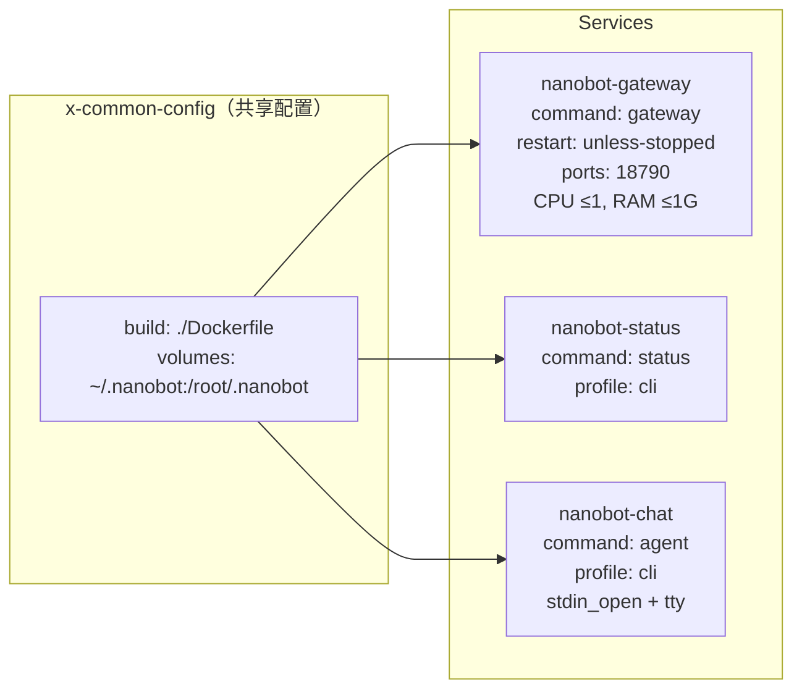

| 服務 | 命令 | Profile | 用途 | 生命週期 |
|:---|:---|:---|:---|:---|
| `nanobot-gateway` | `nanobot gateway` | 預設 | 長期運行：Channel 監聽、Agent 循環、Cron 排程、Heartbeat | 常駐 (`unless-stopped`) |
| `nanobot-status` | `nanobot status` | `cli` | 一次性：顯示 Gateway 狀態 | 執行後退出 |
| `nanobot-chat` | `nanobot agent` | `cli` | 交互式：CLI 對話 | 用戶退出後銷毀 |

**資源限制**（僅 gateway）：

```yaml
deploy:
  resources:
    limits:      # 硬上限
      cpus: '1'
      memory: 1G
    reservations:  # 保證最低分配
      cpus: '0.25'
      memory: 256M
```

#### 12.2.6 ENTRYPOINT 與 CMD 機制

```text
ENTRYPOINT ["nanobot"]  ←  固定前綴，不可被 docker run 參數覆蓋
CMD ["status"]          ←  預設參數，可被覆蓋
```

實際執行效果：

| 啟動方式 | 實際執行命令 |
|:---|:---|
| `docker run nanobot-ai` | `nanobot status` |
| `docker run nanobot-ai gateway` | `nanobot gateway` |
| `docker run nanobot-ai agent -m "hello"` | `nanobot agent -m "hello"` |
| `container exec nanobot-gateway nanobot status` | `nanobot status`（在運行中的容器內執行） |

#### 12.2.7 CLI 輔助腳本

`@bin/` 目錄提供跨引擎的統一操作介面：

| 腳本 | 功能 | Apple Container | Docker Compose |
|:---|:---|:---|:---|
| `bin/nanobot-chat` | 對話（支援 `-m` 非交互模式） | `container exec [-it] nanobot-gateway nanobot agent` | `docker compose --profile cli run --rm nanobot-chat` |
| `bin/nanobot-status` | 查看狀態 | `container exec nanobot-gateway nanobot status` | `docker compose --profile cli run --rm nanobot-status` |
| `bin/nanobot-logs` | 查看日誌 | `container logs nanobot-gateway` | `docker compose logs -f nanobot-gateway` |

腳本自動偵測環境，優先使用 Apple Container，fallback 到 Docker Compose。`nanobot-chat` 會根據是否帶 `-m` 參數自動切換 TTY 模式（交互式 vs 單訊息）。

#### 12.2.8 映像大小與構建時間參考

| 項目 | 參考值 |
|:---|:---|
| 映像大小（壓縮後） | ~800MB–1.2GB |
| 構建時間（首次） | 3–5 分鐘（視網路速度） |
| 構建時間（僅源碼變更） | 30–60 秒（Layer 3 快取命中） |
| `docker save` 匯出大小 | ~800MB–1.2GB |

### 12.3 遷移步驟

#### Step 1：在本地構建 Docker 映像

```bash
# 在專案根目錄執行
docker build -t nanobot-ai:latest .
```

#### Step 2：匯出映像為可攜檔案

```bash
docker save nanobot-ai:latest -o nanobot-ai.tar
# 檔案大小約 800MB–1.2GB（含 Node.js + Python 依賴）
```

#### Step 3：傳輸至目標 VPS

```bash
scp nanobot-ai.tar user@your-vps:/opt/nanobot/
```

#### Step 4：在 VPS 上載入映像

```bash
ssh user@your-vps
docker load -i /opt/nanobot/nanobot-ai.tar
```

#### Step 5：複製運行時配置

```bash
# 從本地複製配置（包含 API Keys、Agent 設定）
scp -r ~/.nanobot user@your-vps:~/.nanobot
```

> ⚠️ `~/.nanobot` 包含 API 金鑰等敏感資訊，建議使用加密傳輸且傳輸後檢查權限：
> ```bash
> chmod 700 ~/.nanobot
> chmod 600 ~/.nanobot/*.yaml
> ```

#### Step 6：在 VPS 上啟動服務

```bash
docker run -d \
  --name nanobot-gateway \
  -v ~/.nanobot:/root/.nanobot \
  -p 18790:18790 \
  --restart unless-stopped \
  nanobot-ai:latest gateway
```

#### Step 7：驗證服務

```bash
# 檢查容器狀態
docker ps | grep nanobot-gateway

# 檢查 nanobot 狀態
docker exec nanobot-gateway nanobot status

# 查看日誌
docker logs -f nanobot-gateway
```

### 12.4 使用 Docker Compose 部署（推薦）

將專案中的 `docker-compose.yml` 複製到 VPS，可獲得更完整的管理能力：

```bash
# 複製 compose 配置
scp docker-compose.yml user@your-vps:/opt/nanobot/

# 在 VPS 上啟動
cd /opt/nanobot
docker compose up -d nanobot-gateway

# CLI 工具
docker compose --profile cli run --rm nanobot-status
docker compose --profile cli run --rm nanobot-chat
```

### 12.5 Apple Container 實作詳解

macOS 26+ 內建 **Apple Container**（`container` CLI v0.10.0），提供原生 Linux 容器支援，無需安裝 Docker Desktop。nanobot 完整支援此環境。

#### 12.5.1 Apple Container vs Docker 差異對照

| 特性 | Apple Container | Docker |
|:---|:---|:---|
| **CLI 指令** | `container` | `docker` |
| **映像構建** | `container build -t <tag> .` | `docker build -t <tag> .` |
| **容器建立** | `container create --name <id> <image> <args>` | `docker create --name <id> <image> <args>` |
| **啟動容器** | `container start <id>` | `docker start <id>` |
| **檔案系統掛載** | `--mount type=virtiofs,source=<path>,target=<path>` | `-v <host>:<container>` |
| **埠映射** | `--publish` 或 `-p`（不支援 `--port`） | `-p` |
| **容器內執行** | `container exec [-it] <id> <cmd>`（不支援 `--`） | `docker exec [-it] <id> <cmd>` |
| **日誌查看** | `container logs [-f] [-n N] <id>` | `docker logs [-f] [-n N] <id>` |
| **資源監控** | `container stats [--no-stream]` | `docker stats [--no-stream]` |
| **容器匯出** | `container export <id> -o <file>` | `docker export <id> -o <file>` |
| **虛擬化後端** | Apple Virtualization.framework (VirtIO) | containerd / runc |
| **Compose 支援** | ❌ 不支援 | ✅ `docker compose` |
| **自動重啟** | ❌ 不支援 `--restart` | ✅ `--restart unless-stopped` |

#### 12.5.2 完整部署流程

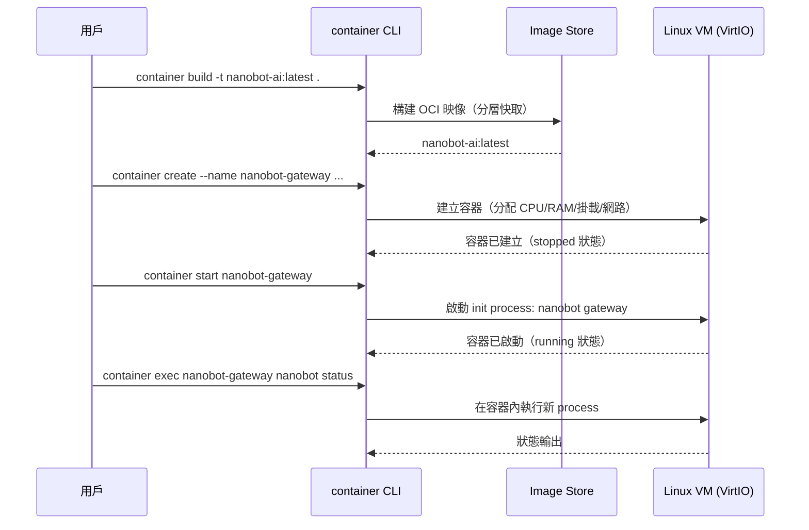

#### 12.5.3 構建映像

```bash
# 基本構建
container build -t nanobot-ai:latest .

# 指定資源（加速構建）
container build -t nanobot-ai:latest -c 4 -m 4G .

# 無快取重建
container build -t nanobot-ai:latest --no-cache .

# 查看已構建的映像
container image list
```

#### 12.5.4 建立與啟動容器

```bash
# 建立容器（完整參數）
container create \
  --name nanobot-gateway \
  --cpus 1 \
  --memory 1G \
  --mount type=virtiofs,source=/Users/danylee/.nanobot,target=/root/.nanobot \
  --mount type=virtiofs,source=/Users/danylee/Desktop,target=/root/Desktop \
  --publish 18790:18790 \
  nanobot-ai:latest gateway

# 啟動容器
container start nanobot-gateway
```

> ⚠️ **注意事項**：
> - `container create` 不會自動啟動容器，必須接 `container start`
> - `--mount` 的 `source` 必須為**絕對路徑**，不支援 `~`
> - 映像名稱（`nanobot-ai:latest`）是**位置參數**，放在所有 flag 之後
> - 容器參數（`gateway`）放在映像名稱之後

#### 12.5.5 當前容器運行狀態

以下為 `container inspect nanobot-gateway` 的關鍵配置摘要：

| 配置項 | 值 |
|:---|:---|
| **容器 ID** | `nanobot-gateway` |
| **映像** | `nanobot-ai:latest` (`sha256:1649a904...`) |
| **狀態** | `running` |
| **平台** | `linux/arm64` |
| **Init Process** | `nanobot gateway` |
| **工作目錄** | `/app` |
| **用戶** | `root` (uid=0, gid=0) |
| **CPU** | 1 核 |
| **記憶體** | 1 GB (1073741824 bytes) |
| **網路** | `192.168.64.8/24`（default 網路） |
| **Gateway** | `192.168.64.1` |
| **埠映射** | `0.0.0.0:18790 → 18790/tcp` |
| **VirtioFS 掛載** | `/Users/danylee/.nanobot → /root/.nanobot` |
| | `/Users/danylee/Desktop → /root/Desktop` |
| **Rosetta** | 停用 |
| **SSH 轉發** | 停用 |

#### 12.5.6 日常操作指令速查

```bash
# 查看運行中的容器
container list                    # 或 container ls

# 查看所有容器（含已停止）
container list --all

# 查看日誌
container logs nanobot-gateway            # 全部日誌
container logs -f nanobot-gateway         # 即時追蹤
container logs -n 50 nanobot-gateway      # 最後 50 行

# 在容器內執行命令
container exec nanobot-gateway nanobot status
container exec -it nanobot-gateway /bin/bash     # 進入 shell
container exec nanobot-gateway ls /root/.nanobot # 列出掛載目錄

# 資源監控
container stats                           # 即時監控所有容器
container stats --no-stream               # 單次快照
container stats nanobot-gateway           # 監控指定容器

# 容器生命週期
container stop nanobot-gateway            # 停止
container start nanobot-gateway           # 啟動
container kill nanobot-gateway            # 強制終止
container rm nanobot-gateway              # 刪除（需先停止）

# 映像管理
container image list                      # 列出映像
container image remove nanobot-ai:latest  # 刪除映像
container prune                           # 清理已停止容器
```

#### 12.5.7 已知限制與注意事項

| 限制 | 說明 | 解決方案 |
|:---|:---|:---|
| **不支援 `--restart`** | 容器不會在崩潰或重啟後自動啟動 | 使用 `launchd` plist 設定開機自啟 |
| **不支援 Compose** | 無法使用 `docker-compose.yml` | 手動使用 `container create` 指令 |
| **`exec` 不支援 `--`** | `container exec <id> -- <cmd>` 會報錯 | 直接 `container exec <id> <cmd>` |
| **必須用完整路徑** | `container exec <id> nanobot` 可能觸發 Docker Hub 拉取 | 使用 `/usr/local/bin/nanobot` |
| **掛載需絕對路徑** | `source=~/.nanobot` 無效 | 使用 `source=/Users/<user>/.nanobot` |
| **新增掛載需重建容器** | 無法動態新增掛載點 | `stop → rm → create → start` |

#### 12.5.8 launchd 開機自啟（可選）

由於 Apple Container 不支援 `--restart`，可建立 launchd plist 實現自動啟動：

```xml
<!-- ~/Library/LaunchAgents/com.nanobot.gateway.plist -->
<?xml version="1.0" encoding="UTF-8"?>
<!DOCTYPE plist PUBLIC "-//Apple//DTD PLIST 1.0//EN"
  "http://www.apple.com/DTDs/PropertyList-1.0.dtd">
<plist version="1.0">
<dict>
    <key>Label</key>
    <string>com.nanobot.gateway</string>
    <key>ProgramArguments</key>
    <array>
        <string>/usr/local/bin/container</string>
        <string>start</string>
        <string>nanobot-gateway</string>
    </array>
    <key>RunAtLoad</key>
    <true/>
    <key>KeepAlive</key>
    <false/>
</dict>
</plist>
```

**什麼是 launchd？**

`launchd` 是 macOS 的**系統服務管理器**（類似 Linux 的 `systemd`）。`launchctl` 是其 CLI 工具。將 plist 放在 `~/Library/LaunchAgents/` 表示這是**用戶級服務**，不需要 sudo 權限。

設定 `RunAtLoad = true` 後，macOS 會在每次用戶**登入時自動啟動** nanobot 容器，無需手動執行 `container start`。

**管理命令：**

```bash
# 註冊並啟用服務（開機自啟）
launchctl load ~/Library/LaunchAgents/com.nanobot.gateway.plist

# 停用服務（取消開機自啟）
launchctl unload ~/Library/LaunchAgents/com.nanobot.gateway.plist

# 檢查服務狀態
launchctl list | grep nanobot
```

**launchctl 操作對照表：**

| 命令 | 作用 | 類比 Linux |
|:---|:---|:---|
| `launchctl load <plist>` | 註冊並啟用服務 | `systemctl enable --now <service>` |
| `launchctl unload <plist>` | 停用並移除服務 | `systemctl disable --now <service>` |
| `launchctl list \| grep nanobot` | 檢查服務是否在運行 | `systemctl status <service>` |
| `launchctl start com.nanobot.gateway` | 手動啟動已註冊的服務 | `systemctl start <service>` |
| `launchctl stop com.nanobot.gateway` | 手動停止已註冊的服務 | `systemctl stop <service>` |

> 注意：macOS 較新版本建議使用 `launchctl bootstrap gui/$(id -u)` 取代 `load`，但 `load` 目前仍可正常使用。

### 12.6 多平台部署對照表

| 環境 | 容器引擎 | 啟動命令 | 配置掛載 |
|:---|:---|:---|:---|
| **macOS 26+** | Apple Container | `container start nanobot-gateway` | `--mount source=~/.nanobot,target=/root/.nanobot,type=virtiofs` |
| **macOS / Linux** | Docker Compose | `docker compose up -d` | `volumes: ~/.nanobot:/root/.nanobot` |
| **Linux VPS** | Docker | `docker run -d -v ~/.nanobot:/root/.nanobot ...` | `-v ~/.nanobot:/root/.nanobot` |

### 12.7 本地目錄掛載指南

容器預設掛載 `~/.nanobot` 作為配置目錄。若需讓容器存取宿主機上的其他目錄（如 Desktop、Documents），需在建立容器時指定額外掛載點。

> ⚠️ 容器不支援動態新增掛載，必須**刪除舊容器後重建**。映像和 `~/.nanobot` 配置不受影響。

#### 掛載語法對照

| 引擎 | 語法 | 備註 |
|:---|:---|:---|
| **Apple Container** | `--mount type=virtiofs,source=<絕對路徑>,target=<容器路徑>` | `source` 必須為絕對路徑，不支援 `~` |
| **Docker** | `-v <宿主機路徑>:<容器路徑>` | 支援 `~` 和相對路徑 |
| **Docker Compose** | `volumes:` 下加 `- <宿主機路徑>:<容器路徑>` | 在 `docker-compose.yml` 中定義 |

#### Apple Container 掛載範例

```bash
# 1. 停止並刪除舊容器
container stop nanobot-gateway
container rm nanobot-gateway

# 2. 重建容器，加入額外掛載點
container create --name nanobot-gateway \
  --mount type=virtiofs,source=/Users/danylee/.nanobot,target=/root/.nanobot \
  --mount type=virtiofs,source=/Users/danylee/Desktop,target=/root/Desktop \
  --mount type=virtiofs,source=/Users/danylee/Documents,target=/root/Documents \
  --publish 18790:18790 \
  nanobot-ai:latest gateway

# 3. 啟動容器
container start nanobot-gateway

# 4. 驗證掛載
container exec nanobot-gateway ls /root/Desktop
container exec nanobot-gateway ls /root/Documents
```

#### Docker 掛載範例

```bash
docker run -d --name nanobot-gateway \
  -v ~/.nanobot:/root/.nanobot \
  -v ~/Desktop:/root/Desktop \
  -v ~/Documents:/root/Documents \
  -p 18790:18790 \
  --restart unless-stopped \
  nanobot-ai:latest gateway
```

#### Docker Compose 掛載範例

修改 `@docker-compose.yml` 的 `volumes` 區段：

```yaml
services:
  nanobot-gateway:
    volumes:
      - ~/.nanobot:/root/.nanobot
      - ~/Desktop:/root/Desktop
      - ~/Documents:/root/Documents
```

#### 目前容器掛載狀態

可使用以下指令查看當前容器的掛載點：

```bash
# Apple Container
container inspect nanobot-gateway | python3 -m json.tool | grep -A3 mounts

# Docker
docker inspect nanobot-gateway --format '{{range .Mounts}}{{.Source}} → {{.Destination}}{{println}}{{end}}'
```

當前 `nanobot-gateway` 掛載點：

| 宿主機路徑 | 容器內路徑 | 用途 |
|:---|:---|:---|
| `/Users/danylee/.nanobot` | `/root/.nanobot` | 配置、Agent workspace、對話歷史 |
| `/Users/danylee/Desktop` | `/root/Desktop` | WeChat 檔案收發目錄 |

### 12.8 自訂與配置變更指南

nanobot 採用**代碼打包進映像 + 配置外掛載**的分離架構。配置變更分為三個等級：

#### 變更影響等級

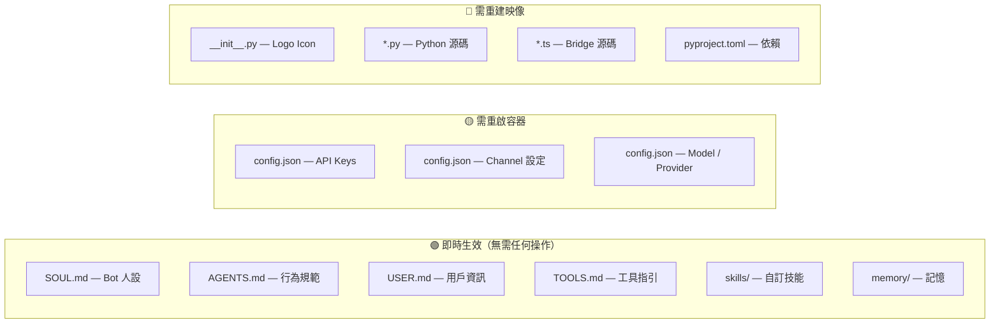

#### 完整對照表

| 變更項目 | 檔案位置 | 重啟容器？ | 重建映像？ |
|:---|:---|:---|:---|
| Bot 人設 / 性格 / 語言風格 | `~/.nanobot/workspace/SOUL.md` | ❌ | ❌ |
| Agent 行為規範 | `~/.nanobot/workspace/AGENTS.md` | ❌ | ❌ |
| 用戶資訊 | `~/.nanobot/workspace/USER.md` | ❌ | ❌ |
| 工具使用指引 | `~/.nanobot/workspace/TOOLS.md` | ❌ | ❌ |
| 自訂技能 | `~/.nanobot/workspace/skills/` | ❌ | ❌ |
| 記憶 / 歷史記錄 | `~/.nanobot/workspace/memory/` | ❌ | ❌ |
| API Keys / Model / Provider | `~/.nanobot/config.json` | ✅ | ❌ |
| Channel 啟用/停用 | `~/.nanobot/config.json` | ✅ | ❌ |
| Gateway 設定（port, heartbeat） | `~/.nanobot/config.json` | ✅ | ❌ |
| Logo / Icon 圖標 | `nanobot/__init__.py` → `__logo__` | — | ✅ |
| Python 源碼修改 | `nanobot/**/*.py` | — | ✅ |
| WhatsApp Bridge 修改 | `bridge/**/*.ts` | — | ✅ |
| 系統依賴變更 | `pyproject.toml` / `package.json` | — | ✅ |

> **原理**：`~/.nanobot` 透過 Volume 掛載至容器 `/root/.nanobot`，宿主機與容器共享同一份檔案。`config.json` 在 Gateway 啟動時載入一次（`@nanobot/config/loader.py:28`），因此修改後需重啟容器。`workspace/` 下的 Markdown 檔案在每次新對話時由 `ContextBuilder` 重新讀取（`@nanobot/agent/context.py:28`），因此即時生效。

#### 操作指令速查

**🟢 修改 workspace 檔案（即時生效）：**

```bash
# 直接編輯，下次對話自動套用
vim ~/.nanobot/workspace/SOUL.md
```

**🟡 修改 config.json（需重啟容器）：**

```bash
vim ~/.nanobot/config.json

# Apple Container
container stop nanobot-gateway && container start nanobot-gateway

# Docker Compose
docker compose restart nanobot-gateway
```

**🔴 修改源碼（需重建映像）：**

```bash
# 1. 重建映像
docker build -t nanobot-ai:latest .

# 2. Apple Container：刪除舊容器 → 重建
container stop nanobot-gateway
container rm nanobot-gateway
container create --name nanobot-gateway \
  --mount type=virtiofs,source=$HOME/.nanobot,target=/root/.nanobot \
  --mount type=virtiofs,source=$HOME/Desktop,target=/root/Desktop \
  --publish 18790:18790 \
  nanobot-ai:latest gateway
container start nanobot-gateway

# 2. Docker Compose：重建 → 重啟
docker compose up -d --build nanobot-gateway
```

#### WeChat 顯示名稱

WeChat 中對方看到的名稱是**微信帳號暱稱**，非 nanobot 配置項：

1. 微信 App → **我** → 點擊頭像區域 → **名字** → 修改

### 12.9 遷移檢查清單

- [ ] Docker 映像已構建並匯出（`nanobot-ai.tar`）
- [ ] `~/.nanobot` 配置目錄已複製至目標 VPS
- [ ] API Keys 在目標環境可用（部分 Provider 有 IP 白名單限制）
- [ ] VPS 防火牆已開放 18790 埠（如需外部訪問 Gateway）
- [ ] WeChat Channel 的回調 URL 已更新為新 VPS 的 IP/域名（如適用）
- [ ] 容器日誌正常，無認證或網路錯誤

---

## 自我審計結果

| Check | 狀態 | 說明 |
|:---|:---|:---|
| **Check 1**: 全部代碼已分析？ | ✅ | 74 Python + 4 TypeScript 文件全部覆蓋 |
| **Check 2**: 改進建議可落地？ | ✅ | 5 項建議均附帶完整代碼範例 |
| **Check 3**: Mermaid 語法正確？ | ✅ | 已遵循雙引號轉義規則 |
| **Check 4**: 節點 ≤12？ | ✅ | 所有圖表使用 subgraph 物理隔離 |
